# bb viewer

a terminal-themed web explorer for windows sdk and phnt header analysis data, produced by [bb](https://github.com/cristeigabriela/bb).

browse 8,000+ functions with full abi layouts, 5,000+ types with memory visualizations, 25,000+ constants with c expressions, and an interactive type relationship graph — all from your browser.

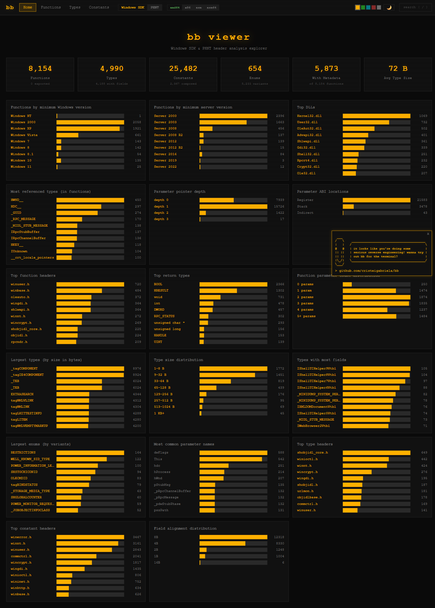

## features

### functions

browse, search (glob/regex), and filter windows api functions by header, dll, return type, parameter count, pointer depth, and minimum windows version.

each function detail page shows the full c prototype, abi register/stack layout, msdn metadata (dll, lib, min client/server, variants), known parameter values with linked constants, and referenced types.

| | |
|---|---|
| 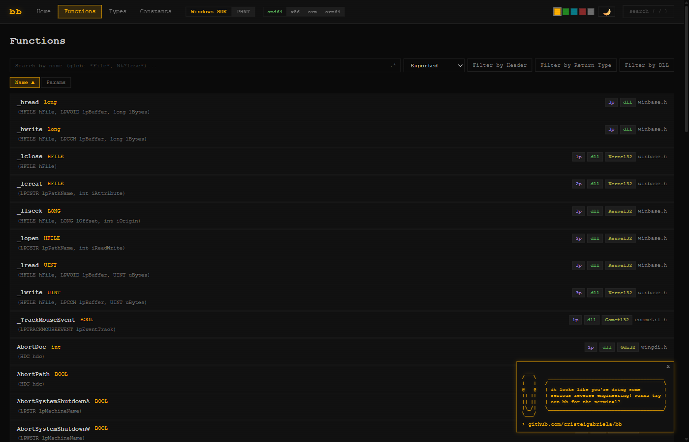 | 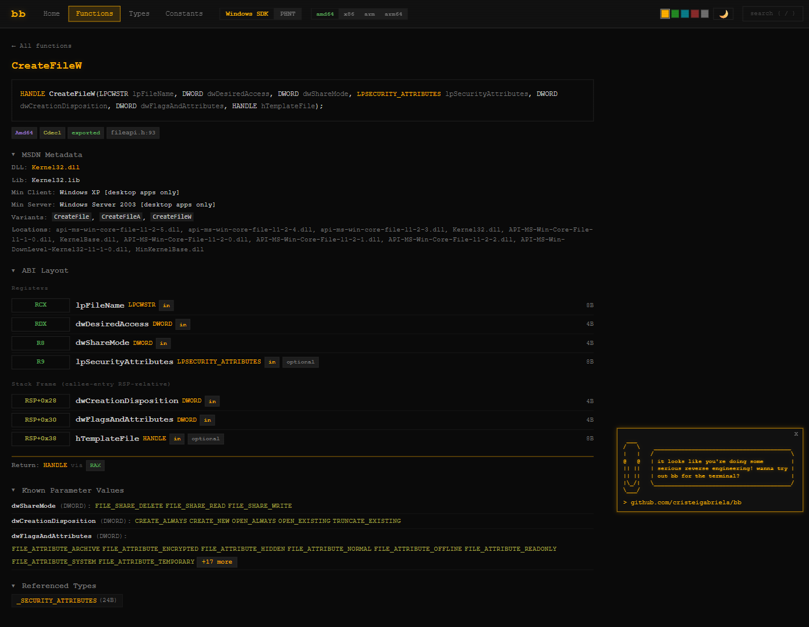 |
| *function list with filters* | *CreateFileW — abi layout, metadata, known values* |

### types

explore struct/union layouts with field tables, memory visualizations, inline nested type expansion, and cross-references to functions that use each type.

| | |
|---|---|
| 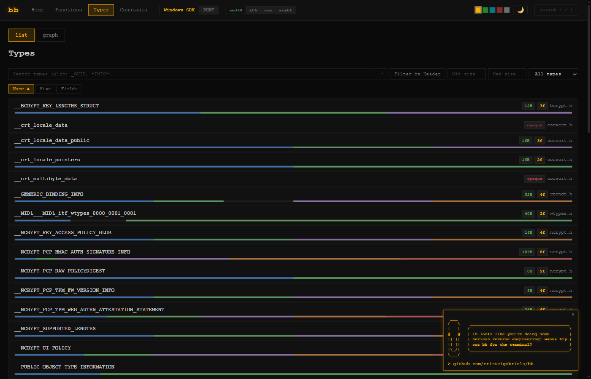 | 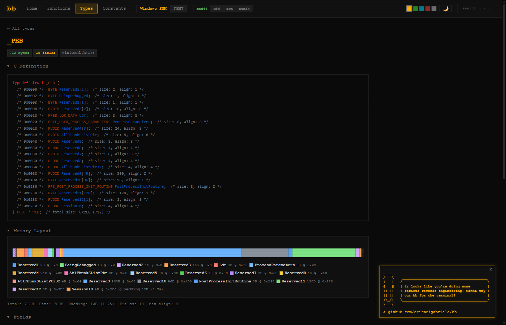 |
| *type list with memory bars* | *_PEB — c definition, memory layout, fields* |

### type graph

interactive force-directed graph of type relationships (precomputed with d3-force, rendered with cytoscape.js). click a node to highlight its neighborhood, search and sort by connection count.

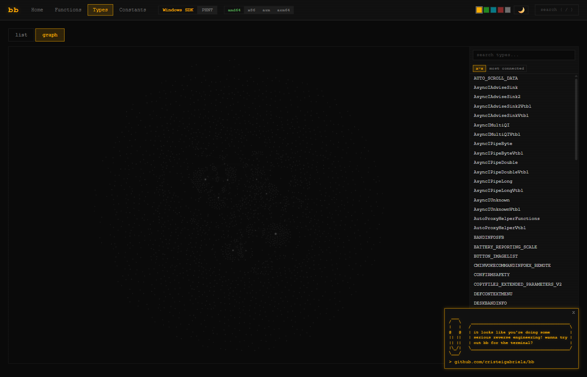

### constants

browse macro constants and enums with values, hex, c expressions (syntax-highlighted), and composition breakdowns.

| | |
|---|---|
| 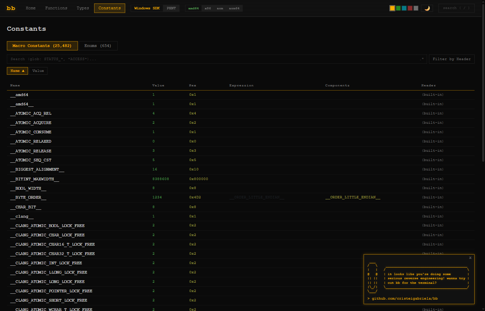 | 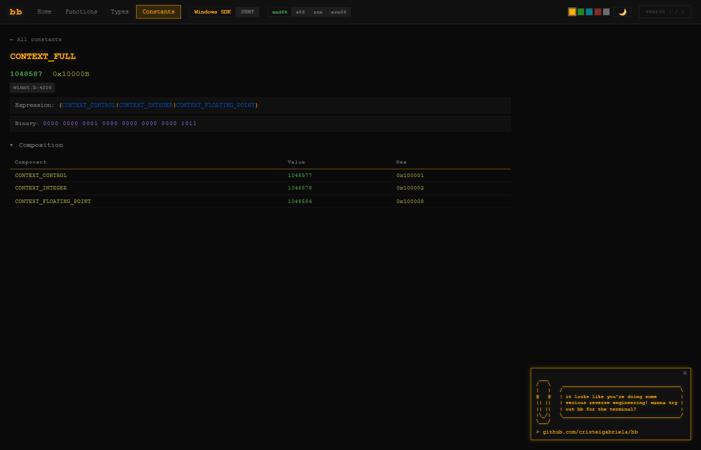 |
| *constants table with expressions* | *CONTEXT_FULL — expression, binary, composition* |

### search

centered modal search (press `/`) across all functions, types, constants, and enums with keyboard navigation (arrow keys, ctrl+j/k, enter, escape) and a live preview pane.

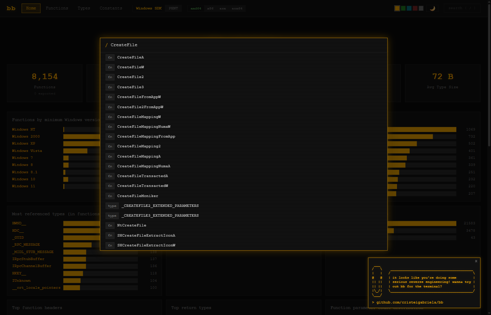

### theming

dark/light mode with 5 accent colors (amber, green, cyan, red, white). terminal aesthetic — courier new, no rounded corners, scanline overlay, text shadows.

| | |
|---|---|
|  | 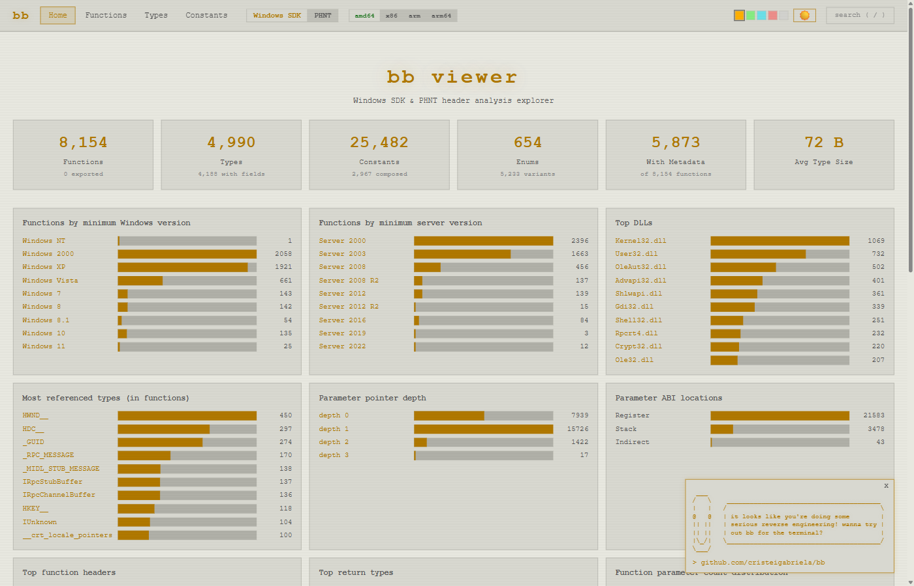 |
| *dark mode (amber accent)* | *light mode* |

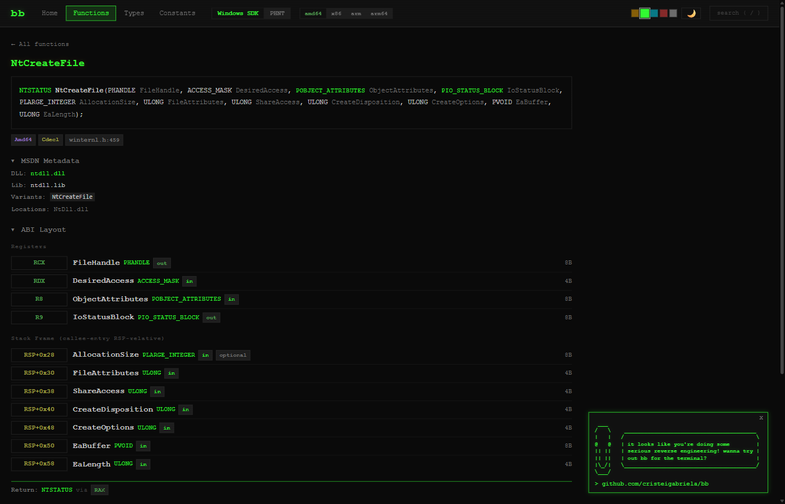
*NtCreateFile with green accent — phnt dataset*

### datasets & architectures

switch between windows sdk and phnt headers, across amd64, x86, arm, and arm64 architectures from the navbar.

## getting started

```powershell
bun install
bun run build

# generate data (requires bb built + windows sdk)
.\generate-data.ps1

# precompute type graphs
bun run build:graph

# start dev server
bun run dev
# → http://localhost:3000
```

## data generation

requires [bb](https://github.com/cristeigabriela/bb) built at `C:\dev\rust\bb\bb` and windows sdk installed.

```powershell
.\generate-data.ps1                    # all datasets, all archs
.\generate-data.ps1 -Dataset phnt     # only phnt
.\generate-data.ps1 -Arch amd64       # only amd64
```

the script auto-detects the windows sdk path. after generating data, run `bun run build:graph` to update the type relationship graphs.

## stack

- **runtime**: vanilla typescript, no framework — plain dom manipulation with a hash router
- **build**: bun bundler
- **syntax highlighting**: [arborium](https://github.com/bearcove/arborium) (c language)
- **type graph**: [cytoscape.js](https://js.cytoscape.org/) with [d3-force](https://d3js.org/d3-force) precomputed layouts
- **data source**: [bb](https://github.com/cristeigabriela/bb) — windows sdk/phnt header analysis via libclang
